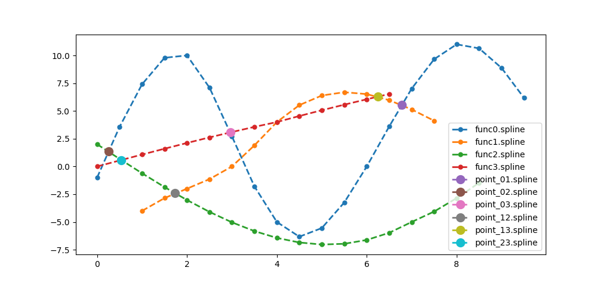

Для корректного запуска **добавьте ссылку** на скрипт
в папку `/usr/bin`, чтобы иметь возможность _**запускать
программу из любой папки**_.

```shell
sudo ln -s $(pwd)/create-spline /usr/bin/
```

**Протестировать работу** можно с помощью приложенного к
репозиторию файла `input.txt`.

```shell
create-spline input.txt
```

**Результат** на входных данных `input.txt`.


